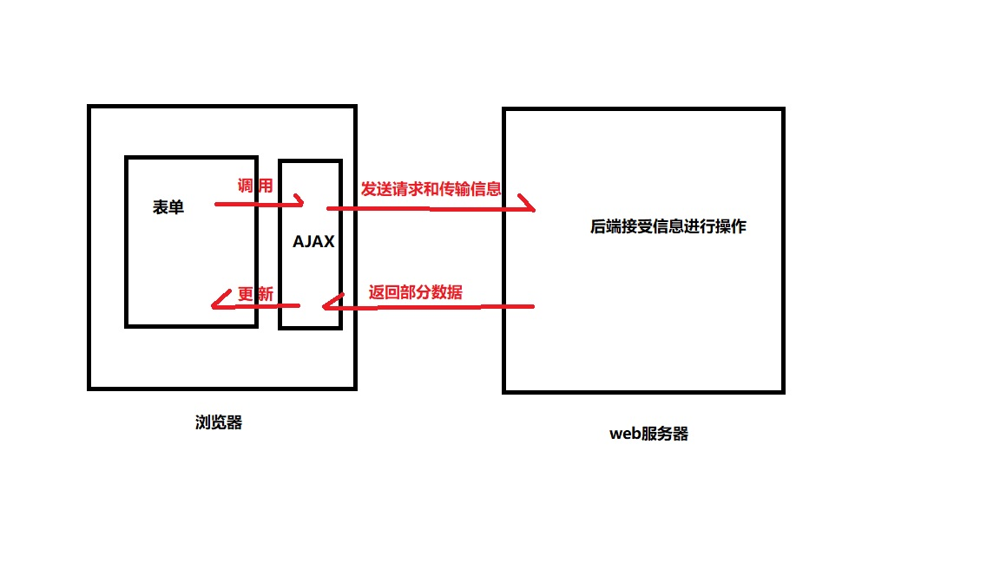

## 什么是AJAX?

Asynchronous JavaScript and Xml,异步的JavaScript和Xml  

AJAX是一种用来改善用户体验的技术,其实质是,使用XMLHttpRequest对象异步地向服务器发送请求  

通过在后台与服务器进行少量数据交换，AJAX 可以使网页实现异步更新。这意味着可以在不重新加载整个网页的情况下，对网页的某部分进行更新。
传统的网页（不使用 AJAX）如果需要更新内容，必需重载整个网页面。

有很多使用 AJAX 的应用程序案例：新浪微博、Google 地图、开心网等等。

## AJAX原理



AJAX在传递数据过程中,此时用户可以继续对表单进行相应的操作,而返回的部分数据也会无刷新的显示在页面上。

## AJAX对象的常用属性和方法

|属性/方法|说明|
|-----|-----|
|abort()|取消请求|
|getAllResponseHeaders()|获取响应的所有Http头|
|getResponseHeader()|获取指定的Http头|
|open(method,url,bool)|创建请求，method为请求类型,get或post,bool为true是异步,false为同步|
|send|发送请求|
|setRequestHeader()|指定请求的Http头|
|onreadystatechange|发生任何状态变化时的事件控制对象|
|readyState|请求的状态:<br> 0 尚未初始化 <br>1 正在发送 <br>2 请求完成<br> 3 请求成功，正在接受数据<br> 4 数据接受成功|
|responseText|服务器返回的文本|
|responseXML|服务器返回的xml,可以当作DOM处理|
|status|服务器返回的http请求响应值常用有<br>200:服务器响应正常<br>304:该资源在上次请求之后没有任何修改(通常用于浏览器缓存机制)<br>400:无法找到请求的资源<br>401:访问资源的权限不够<br>403:没有权限访问资源<br>404:需要访问的资源不存在<br>405:需要访问的资源被禁止<br>414:请求的url太长<br>500:服务器内部错误|

<!--more-->

## 向服务器发送请求

### 步骤

1. 获取AJAX对象.
2. 创建请求
3. 设置回调函数
4. 发送请求

### 获取AJAX对象

所有现代浏览器（IE7+、Firefox、Chrome、Safari 以及 Opera）均支持 XMLHttpRequest 对象。

```javascript
var xhr = new XMLHttpRequest();
```

IE7以下使用 ActiveX 对象：

```javascript
var xhr = new ActiveXObject("Microsoft.XMLHttp");
```

为了应对所有的现代浏览器,也为了方便以后的使用,可以如下编写

```javascript
function getXhr(){
  var xhr;
  if(window.XMLHttpRequest){
    xhr = new XMLHttpRequest();
  }else{
    xhr = new ActiveXObject('Microsoft.XMLHttp');
  }
  return xhr;
}
//如果想获取xhr的话可以直接调用此函数

var xhr = getXhr();
```
### 创建请求&&发送请求

创建和发送连在一起好讲一些,所以就打乱了步骤顺序进行了讲解

#### GET、POST的差别

- 与POST相比,GET更简单也更快,并且在大部分情况下都能用
- GET请求只能进行URL编码,而POST支持多种编码方式
- GET请求参数会被完整保留在浏览器历史记录里,而POST的参数不会
- GET请求在URL中传送的参数是有长度限制的,而POST没有
- GET的参数直接暴露在URL中,因此相对于POST更不安全

#### GET

没有传递参数的get请求

```js
var xhr = getXhr();//前面写的获取xhr的函数
xhr.open("get","get.php",true);
xhr.send(null);
```

传递参数的get请求

```js
var xhr = getXhr();
xhr.open("get","get.php?uname=Hutchins",true);
xhr.send(null);
```

#### POST

没有传递参数的post请求

```js
var xhr = getXhr();
xhr.open("post","post.php",true);
xhr.send(null);
```

传递参数的post请求

```js
var xhr = getXhr();
xhr.open("post","post.php",true);
xhr.setRequestHeader("Content-type","application/x-www-form-urlencoded");//手动设置HTTP头
xhr.send("uname=Hutchins");//post方式要在此处传递参数
```

### 设置回调函数

```js
//这段代码插入创建请求和发送请求中间
xhr.onreadystatechange = function(){
  if(xhr.readyState == 4 && xhr.status == 200){
    var resText = xhr.responseText;
    //数据添加的DOM操作
  }
}

```

## 注意

html文件和php文件要同在服务器上,如果html文件链接是file开头是不行的。


