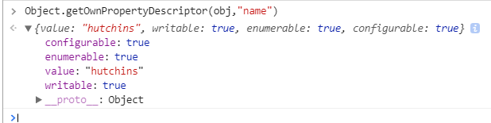
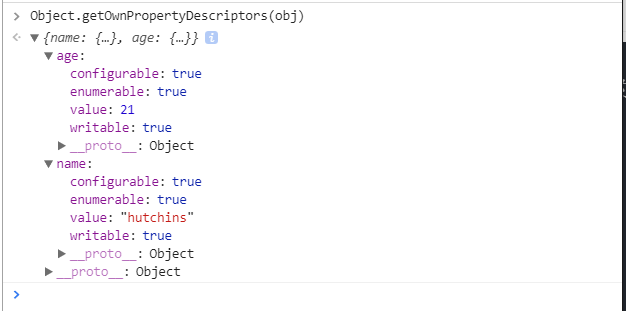
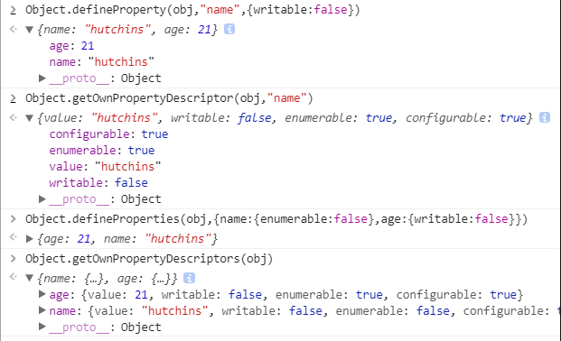
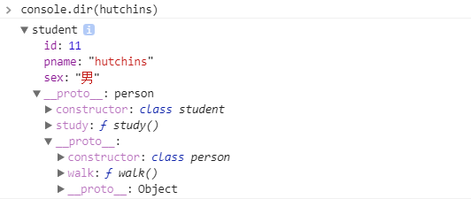

## 引言

七夕也要来了唉，没对象的抓紧时间``new``一个了，已经``new``过的来和我更深入的了解一下我们的"对象"吧

## 保护对象

传统的js中，对象的属性和结构，可以随意更改，毫无自保和验证的能力。我们怎么能容忍我们的"对象"被随意篡改呢！

## 对象的属性

### 命名属性

代码中可直接用，分为两种：数据属性和访问器属性

### 数据属性

专门存数对象的一个属性值的属性，数据属性可以在创建对象时就定义好，也可以在创建完对象后，采用赋值方式增加新数据属性。  
ES5之前，程序员都是通过赋值方式，添加新的属性，而添加的属性随时可修改，可遍历。
<!--more-->
#### 属性的特性

ES5之后，每个数据属性都有了四个特性来保护数据属性，对象的属性也变成了一个小小的对象。四个特性如下。

|特性名|描述|
|----|-----|
|value|实际存储属性值的特性|
|writable|表示能否修改属性的value值。默认为true。如果设置为false，则该属性为只读|
|enumerable|表示能否通过for..in循环遍历到该属性,默认为true.如果改为false,则使用for..in无法遍历到|
|configurable|表示能否通过delete删除该属性或能否修改其它属性。默认为true.但如果改为false，则属性的其它特性一旦定义，不可修改。该属性也不能改回true|

#### 获取属性的特性

```js
var obj = {name:"hutchins",age:20};
Object.getOwnPropertyDescriptor(obj,"hutchins");
```



当然也可以获取全部属性的特性



#### 修改属性的特性

```js
//这种方法只能修改一个
Object.defineProperty(obj,"属性名",{
  特性名:值,
  ....:...,
})
//这种可以同时修改多个属性
Object.defineProperties(obj,{
  属性名:{
    特性名：值,
    ...:...,
  },
  属性名:{
    特性名：值,
    ...:...,
  }
})
```

举个栗子



### 访问器属性

不实际存储数据，专门提供对其它数据/变量的保护，控制对一个数据属性读写操作的特殊属性，它不包含具体属性值。而是包含一对get/set方法

```js
//创建对象时定义数据类型
var person = {name:"hutchins",_age:20}
//创建对象后，通过definedProperty添加对age属性的保护
//可用defineProperties修改多个。
Object.defineProperty(person,"age",{
  get:function(){return this._age;},
  set:function(value){
    if(val>=18&&val<=65) this._age=value;
			else throw new RangeError("年龄必须介于18~65之间");
  }
  //可以写四大特性
})
console.log(person.age);//自动调用get
person.age = 20;//自动调用set
```

强行访问``_age``,就等于略过了访问器属性,不过上面这种写法不像是封装，都散在了外面，当然我们也可以包起来写在构造函数当中。

```js
function Student(id, sname, age) {
  //this->new的对象
  this.id = id;
  this.sname = sname;
  Object.defineProperties(this,{
    id:{writable:false},
    sname:{writable:false},
    _age:{value:null,writable:true},
    age:{
      get:function(){return this._age},
      set:function(value){
        //对传进来的value进行操作
        //将操作后的value赋值给_age
        this._age = value;
      }
    }
  })
  //经过访问器属性后才赋值
  this._age = age;
}
var hutchins = new Student(11,"hutchins",20);
```

### 内部属性

及不能用"."访问到的属性,但是可以通过特定的方法去访问到

#### \_\_proto__

引用当前对象继承的原型对象

Object.getPrototypeOf(obj)  Object.setPrototypeOf(child,father)

#### class

对象的类型名
Object.prototype.toString.call(obj)

#### extensible

可扩展,表示是否能为对象扩展新属性

Object.isExtensible(obj)  
Object.preventExtensions(obj)

## 防篡改

ES3标准的JavaScript中，程序员可以在任何时候，任何位置，无论有意还是无意的修改任何对象的属性，这些篡改可能会影响内置对象的内置属性和方法，导致正常的功能无法正常执行。

### 防扩展

这个在前面说了。再次再拉出来溜一圈

Extensible

Object.isExtensible(obj)获取对象是否可扩展

Object.preventExtensions(obj)将Extensible改为false,一旦改为false,就不能再改回true

### 密封对象

在防扩展的同时，禁止删除现有属性，相当于将每个属性的configurable设置为false

Object.isSeal(obj)获取对象是否为密封对象

Object.seal(obj)密封obj

### 冻结对象

不允许对对象的现有属性及其属性值做任何修改，也不允许增加新属性，相当于将每个属性的writable设置为false

Object.isFrozen(obj);判断是否被冻结

Object.freeze(obj) 冻结obj

## class

ES6新特性，借鉴了其它编程语言中声明对象的方式，正式启用class关键字来创建"类"，再创建"类"的实例:"对象"

简化了面向对象中的封装继承和多态,并且让代码更贴近了这些方法。

### 封装

```js
//用class类型名{}包裹原来的构造函数和原型对象方法
class person{
  //构造函数
  constructor(pname,sex,age){
    this.pname = pname;
    this.sex = sex;
  }
  walk(){//person.prototype.walk
    console.log("walking..");
  }
}

var hutchins = new person("hutchins","男");
hutchins.pname;//hutchins
hutchins.walk();//walking
```

ES6中的class也可以用get/set访问器属性实现虚拟扩展和属性值的验证,它们在构造函数的平级

```js
class person{
  constructor(pname,sex,age){
    this.pname = pname;
    this.sex = sex;
    Object.defineProperty(this,"_age",{
      writable:true,
      value:null
    })
    this.age = age;
  }
  //定义的访问器属性名就是外部能访问到的
  get age(){return this._age}
  set age(val){
    if(val>=18&&val<=65){
      this._age = val;
    }else{
      throw new RangeError("年龄必须介于18~65之间")
    }
  }
}
var hutchins = new person("hutchins","男",21);
```


可以看到我们访问器的属性已经生效，使用还是像以前一样使用，不需要出现get/set这种字样，当执行获得和赋值操作时，他会根据你的操作调用不同的方法。

### 继承

ES6中不用再设置``Object.setPrototypeOf``,在"class 类型后"添加"``extends`` 父类型"即可

 在构造函数中借用父类型构造函数也不需要用``call/apply``来改变此时的``this``,直接用``super(属性值列表)``就可以。

 举个栗子

 ```js
class person{
  constructor(pname,sex){
    this.pname = pname;
    this.sex = sex;
  }
  walk(){
    console.log("walking...");
  }
}
//定义student继承person
class student extends person{
  //student的构造方法
  constructor(pname,sex,id){
    super(pname,sex);
    this.id = id;
  }
  //student.prototype
  study(){
    console.log("studying...");
  }
}
    
var hutchins = new student("hutchins","男",11);
 ```

hutchins的结构:

 

## 最后

怎么样，是不是对你的七夕对象又更加了解了呢~还没``new``的抓紧时间啦啊


