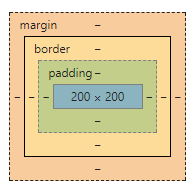
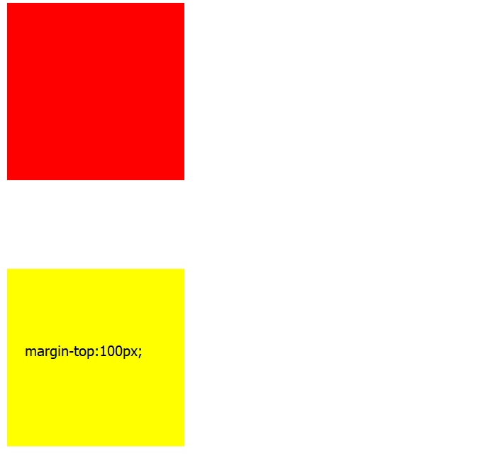
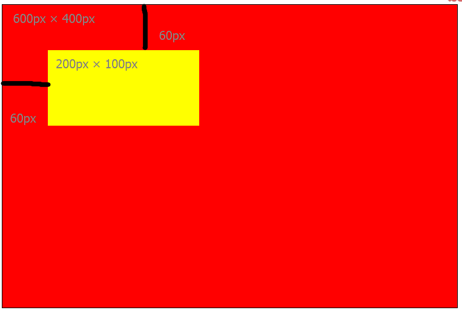
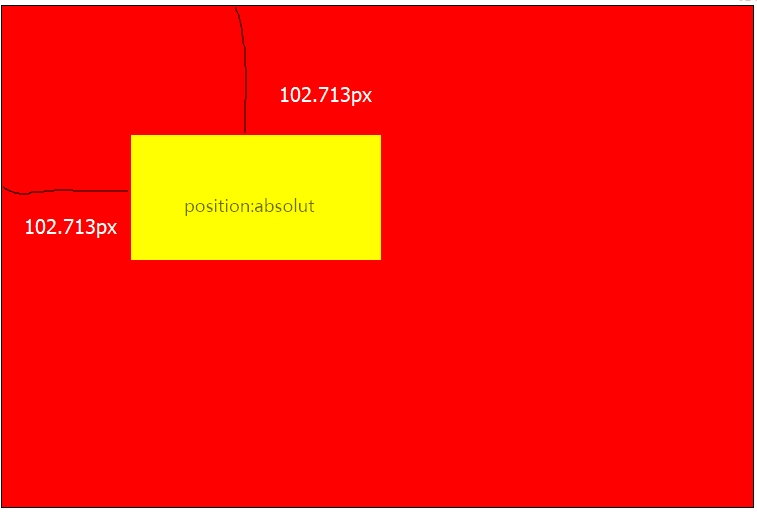
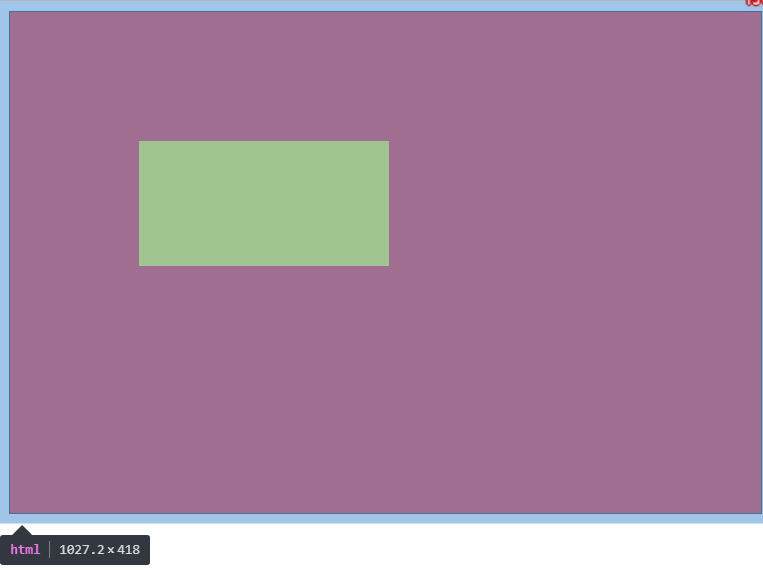
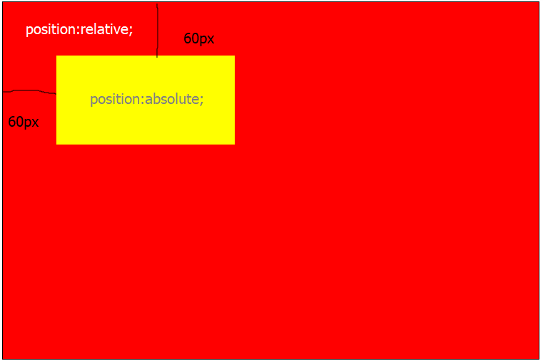
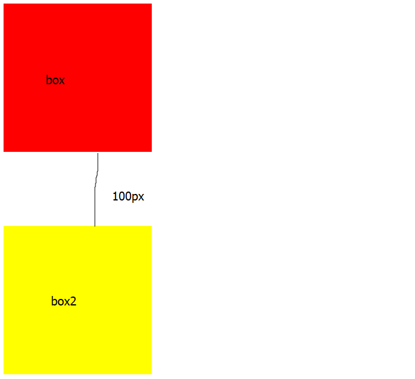
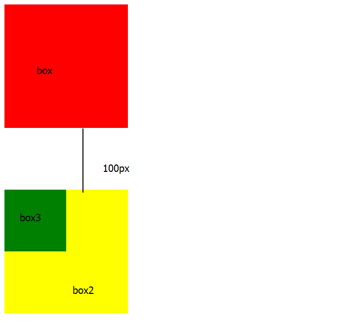
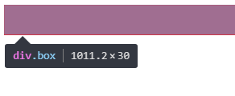

# Margin(外边距)

Margin是一个蛮调皮的属性，在这里记录一下学margin过程中碰到的一些问题和一些解决办法，以及一些大佬的教诲.

## Margin简介

css margin属性定义元素周围的空间。



这是在chrome浏览器下开发者工具中的盒子模型，可以看到margin就是在border外的部分.并且它有上下左右四个方向

#### margin后面可以有一到四个参数
margin:20px;表示四个方向外边距都为20px;  
margin:10px 20px;表示上下外边距为10px,左右外边距20px;  
margin:10px 20px 30px;表示上边距20px,左右边距20px,下边距30px;  
margin:10px 20px 30px 40px;按顺时针方向依次为上右下左为10px,20px,30px,40px;

#### margin始终是透明的  



设置两个高宽都为200px的div,第一个没有设置margin,第二个设置margin-top:100px;可以看到两个div有了100px的距离，但是那块距离中间没有任何填充，始终是透明的.

#### margin没有继承性

父元素设置margin值并不会传递到他的子元素

## Margin百分比单位

在实际开发过程中,我们有时候想要外边距随着浏览器的大小而变化，就要设置margin的单位为百分比，但设置了之后发现并不是自己想要的结果

### 普通元素



看到黄色div的上边距和左边距都为60px,不用于height,width用百分比单位,普通元素的margin百分比单位都是相对于容器的宽度计算的.
<!--more-->
### 绝对定位元素



当黄色div设置了绝对定位后,上下边距变成了102.713px,和红色div的宽高没有了联系.此时我们看一下html元素的宽高



黄色div的边距变成了html宽的百分之十,我们把红色div加一个相对定位再看一下



可以发现黄色div此时的外边距又变成了红色div宽度的百分之十

绝对定位元素的margin百分比单位是相对于第一个定位祖先元素(absolute/relative/fixed)的宽度计算的

## Margin重叠

### Margin外边距重叠的条件
- margin重叠只发生在块级元素上;
- 浮动元素的margin不与任何margin发生重叠;
- 设置了属性overflow且值不为visible的块级元素，将不与它的子元素发生margin重叠;
- 绝对定位元素的margin不与任何margin发生重叠;
- 根元素的margin不与其它任何margin发生重叠;
- Margin重叠只发生在垂直方向

> 因此只要让其中一条条件不满足就可以避免margin外边距重叠

### 相邻兄弟元素的重叠

```css
.box {
  width: 200px;
  height: 200px;
  background: red;
  margin-bottom: 100px;
}
.box2 {
  width: 200px;
  height: 200px;
  background: yellow;   
  margin-top: 100px;
}
```


```html
<div class="box"></div>
<div class="box2"></div>
```


### 父级元素和第一个/最后一个子元素

```css
.box {
  width: 200px;
  height: 200px;
  background: red;
}
.box2 {
  width: 200px;
  height: 200px;
  background: yellow;   
}
.box3{
  width: 100px;
  height: 100px;
  background: green;
  margin-top: 100px;
}
```

```html
<div class="box">    
</div>
<div class="box2">
  <div class="box3"></div>
</div>
```



这里其实就相当于给父元素加了一个``margin-top:100px``的属性

发生父子margin的重叠还需具备以下几个条件.

- 父元素非块状格式化上下文元素
- 父元素没有``border-top``设置
- 父元素没有``padding-top``设置
- 父元素和第一个字元素之间没有``inline``严肃分隔

上面说的是``margin-top``重叠,那``margin-bottom``重叠就把相应的``top``改为``bottom``,只不过还多一个条件，就是父元素没有``height``,``min-height``,``max-height``限制.

既然知道了父子元素margin重叠需要具备的条件，那么就也知道了解决父子元素margin重叠的方法。

### 解决父子元素margin重叠的方法

- 给父元素添加``overflow:hidden``
- 给父元素设置``border-top``
- 给父元素设置``padding-top``
- 在父元素和第一个子元素之间添加``inline``元素


### 空block元素

```css
.box {
  background: red;
  overflow: hidden;
}
.box2 {
  margin: 30px 0;
}
```

```html
<div class="box">
  <div class="box2"></div>
</div>
```



图中的高度只有30px,上下30px,不应该是60px吗？那显然也是发生了margin重叠

### 条件

- 元素没有border设置
- 元素没有padding设置
- 里面没有inline元素
- 没有height,或者min-height

> 同样,满足条件及解决办法.

### Marin重叠的计算规则

Margin重叠也有它自己的计算规则,就是正正取大值,正负值相加,负负取小值

## Margin在各种元素之间的表现.

首先，margin在块级元素中是可以完美表现的,但是垂直方向的margin对非置换的内联元素是无效的,margin对某些表格显示类型的元素也是无效的（除了table,table-caption,inline-table）,例如table-cell,table-row。  

**置换元素**就是指 img|input|select|textarea|button|label等元素,这些元素拥有内在的尺寸,他们可以设置width/height属性，他们的性质同设置了``display:inline-block``属性一样。

>当然margin还有很多问题,小白我在以后碰到话当然会总结整理出来，大家共同学习，共同进步
