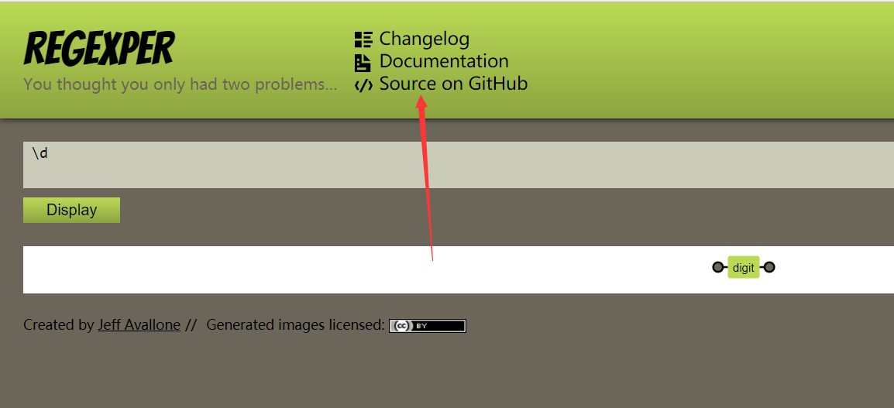
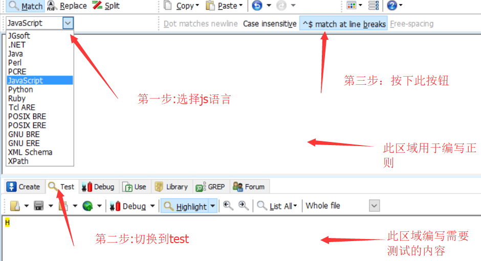
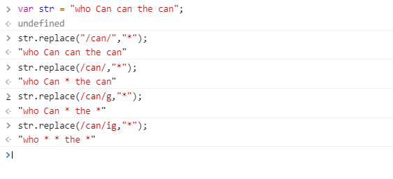
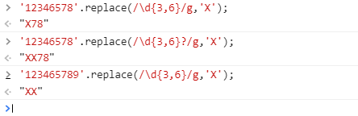
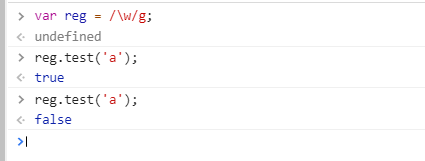
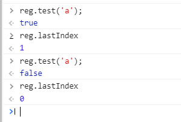
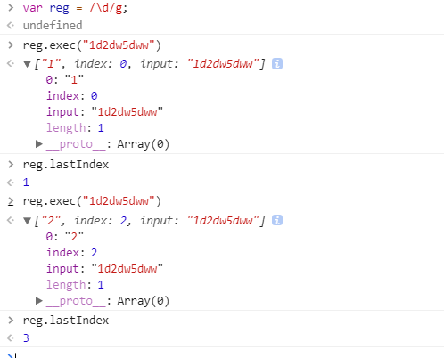
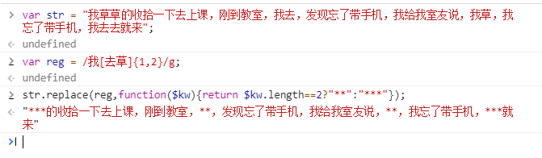

>正则表达式一直都是自己最薄弱的一块，平时不怎么用，只有用的时候上网上查一查是怎么写的，自己从来没有去学习一下里面的语法，最近学习了一下js正则表达式的语法，觉得如果不让常用的话也还是会忘掉，与其查百度，看别人介绍js正则表达式，不如自己写一篇博客来记录描绘一下正则表达式。

## 简介

>正则表达式(regular expression)描述了一种字符串匹配的模式（pattern），可以用来检查一个串是否含有某种子串、将匹配的子串替换或者从某个串中取出符合某个条件的子串等。 ----**菜鸟教程**

简单的来说，就是按照某种规则去匹配符合条件的字符串

## 工具

写正则表达式不一定要纯凭想象力，可以借助一些简单的工具帮助自己更快更对的写出正则表达式。
<!--more-->
### REGEXPER

[regexper](https://regexper.com)是一个在线可视化用于写正则表达式的工具，因为用外网，所以有时速度会很慢，我们可以把他下载到本地。


点击Source on Github会跳转到其github中，然后按照readme一步步安装就好了，在本地速度会快很多，需要node环境。

### RegexBuddy

这是一款本地的用于测试正则表达式的工具,下载安装不多说。



## 创建RegExp对象

创建`RegExp`对象有两种方法

直接量语法

```js
var reg = /pattern/attributes;
```

调用RegExp构造方法
```js
var reg = new RegExp(pattern,attributes);
```

举个栗子

```js
var reg = /\d/g;//具体含义后面再讲解
var reg = new RegExp("\\d","g");//反斜线本身就是特殊字符，需要转义
```

调用`RegExp`构造方法有一个好处是里面可以执行js代码，实现动态匹配

```js
var arr = ['老大','老二'];//里面的内容动态变化
var reg = new RegExp(arr.join("|"),"g");
```

## 语法

### 修饰符

创建正则时的那个attributes.

|修饰符|描述|
|-----|----|
|i|ignoreCase,执行对大小写不敏感的匹配|
|g|global,执行全局匹配(查找所有匹配而不是在第一次匹配后停止)|
|m|multiline,允许执行多行匹配|

看下图~ replace中的js正则不能打引号,直接用就好,replace也无法改变原字符串,可以用 ``str=str.replace()``获取



### 普通字符

所有的的单个大小写字母、数字都是一个正则表达式,用来匹配单个字符,这个字符与它本身相同。

### 非打印字符

|字符 |描述|
|-----|--|
| \cx&nbsp;&nbsp;&nbsp; |匹配由x指明的控制字符。例如， \cM 匹配一个 Control-M 或回车符。x 的值必须为 A-Z 或 a-z 之一。否则，将 c 视为一个原义的 'c' 字符。|
| \f |匹配一个换页符。等价于 \x0c 和 \cL。|
| \n |匹配一个换行符。等价于 \x0a 和 \cJ。|
| \r |匹配一个回车符。等价于 \x0d 和 \cM。|
| \s |匹配任何空白字符，包括空格、制表符、换页符等等。等价于 [ \f\n\r\t\v]。|
| \S |匹配任何非空白字符。等价于 [^ \f\n\r\t\v]。|
| \t |匹配一个制表符。等价于 \x09 和 \cI。|
| \v |匹配一个垂直制表符。等价于 \x0b 和 \cK。|

### 特殊字符

|特别字符|描述
|---|---|
|$&nbsp;&nbsp;&nbsp;&nbsp;&nbsp;&nbsp;&nbsp;&nbsp;&nbsp;&nbsp;&nbsp;&nbsp;&nbsp;|匹配输入字符串的结尾位置。如果设置了 RegExp 对象的 Multiline 属性，则 $ 也匹配 '\n' 或 '\r'。要匹配 $ 字符本身，请使用 \$。|
| ( ) |标记一个子表达式的开始和结束位置。子表达式可以获取供以后使用。要匹配这些字符，请使用 \( 和 \)。|
| * |匹配前面的子表达式零次或多次。要匹配 * 字符，请使用 \*。|
| + |匹配前面的子表达式一次或多次。要匹配 + 字符，请使用 \+。|
| . |匹配除换行符 \n 之外的任何单字符。要匹配 . ，请使用 \. 。|
| [ |标记一个中括号表达式的开始。要匹配 [，请使用 \[。|
| ? |匹配前面的子表达式零次或一次，或指明一个非贪婪限定符。要匹配 ? 字符，请使用 \?。|
| \ |将下一个字符标记为或特殊字符、或原义字符、或向后引用、或八进制转义符。例如， 'n' 匹配字符 'n'。'\n' 匹配换行符。序列 '\\' 匹配 "\"，而 '\(' 则匹配 "("。|
| ^ | 匹配输入字符串的开始位置，除非在方括号表达式中使用，此时它表示不接受该字符集合。要匹配 ^ 字符本身，请使用 \^。|
| { |标记限定符表达式的开始。要匹配 {，请使用 \{。|


下面我会将这些再分类并详细介绍一下。

### 字符集

|语法|含义|
|----|----|
|[abc]|匹配指定集合内的任意一个字符|
|[^abc]|匹配不在指定集合内的任意字符|
|[0-9]|匹配任意一个数字|
|[a-z]|匹配任意一个小写字母|

### 预定义字符集

正则表达式可以使用如下元字符引用来进行简化

| 语法 | 含义 |
|------|------|
|\d|匹配一个数字，等价于[0-9]|
|\D|匹配一个非数字,等价于[^0-9]|
|\w|匹配一个数字/字母/下划线，等价于[0-9a-zA-Z_]|
|\W|匹配一个非数字/字母/下划线，等价于[^0-9a-zA-Z_]|
|\s|匹配一个空白字符|
|\S|匹配一个非空白字符|
|.|匹配除了回车和换行外的任何单个字符|

### 数量词

| 字符 | 描述 |
|----|----|
|* | 匹配前面的子表达式零次或多次。例如，zo* 能匹配 "z" 以及 "zoo"。* 等价于{0,}。|
|+ | 匹配前面的子表达式一次或多次。例如，'zo+' 能匹配 "zo" 以及 "zoo"，但不能匹配 "z"。+ 等价于 {1,}。|
|? | 匹配前面的子表达式零次或一次。例如，"do(es)?" 可以匹配 "do" 或 "does" 中的"do" 。? 等价于 {0,1}。|
|{n} | n 是一个非负整数。匹配确定的 n 次。例如，'o{2}' 不能匹配 "Bob" 中的 'o'，但是能匹配 "food" 中的两个 o。|
|{n,} | n 是一个非负整数。至少匹配n 次。例如，'o{2,}' 不能匹配 "Bob" 中的 'o'，但能匹配 "foooood" 中的所有 o。'o{1,}' 等价于 'o+'。'o{0,}' 则等价于 'o*'。|
|{n,m} | m 和 n 均为非负整数，其中n <= m。最少匹配 n 次且最多匹配 m 次。例如，"o{1,3}" 将匹配 "fooooood" 中的前三个 o。'o{0,1}' 等价于 'o?'。请注意在逗号和两个数之间不能有空格。|

### 定位符

指定位置的匹配

| 字符	| 描述 |
|------|-------|
| ^ &nbsp;&nbsp;&nbsp;&nbsp;&nbsp;&nbsp;&nbsp;&nbsp; |	匹配输入字符串开始的位置。如果设置了 RegExp 对象的 Multiline 属性，^ 还会与 \n 或 \r 之后的位置匹配。|
| $ |	匹配输入字符串结尾的位置。如果设置了 RegExp 对象的 Multiline 属性，$ 还会与 \n 或 \r 之前的位置匹配。|
| \b |	匹配一个字边界，即字与空格间的位置。|
| \B |	非字边界匹配。|
| ?=x | 匹配其后紧接x的字符串 |
| ?!x | 匹配其后没有紧接x的字符串 |

### 贪婪模式与非贪婪模式

  直接上图~

  

  默认情况下是贪婪模式,数字3~6个，他会匹配到最大的数字个数，所以结果是`X78`,在数量词后面加上?后，就开启了非贪婪模式，那就是匹配最小的数字个数，结果就变成了`XX78`.

  那第三个是什么原因呢？当贪婪模式匹配字符串的时候字符个数已经不够最大次数的匹配的时候，会选择更小次数的匹配。开始它匹配了6个，最后又匹配了三个所以结果就是`XX`.

### 或和分组

``/is|not/``匹配is或者not,这个没有什么特别要说的

有的时候我们想匹配一个字符串连续出现一次以上，比如匹配字符串hutchins连续三次,我们可以``/hutchinshutchinshutchins/``,但是这种方式未免太low，我们就会想到用量词,比如 ``hutchins{3}``,但是这样写得到的并不是自己想要的，这种匹配的会是hutchinsss将s的次数匹配了三次，这样我们就要用到分组.``(hutchins){3}``

分组中的反向引用

2015-12-05 => 12/05/2015

```js
'2015-12-05'.replace(/(\d{4})-(\d{2})-(\d{2})/g,'$2/$3/$1');
```

`$1`就代表第一个()中的内容，这样就实现了动态引用

#### 非捕获组

`(?:x)`称为非捕获组（Non-capturing group），表示不返回该组匹配的内容，即匹配的结果中不计入这个括号。

```js
var m = 'abc'.match(/(.)b(.)/);
m // ["abc", "a" , "c"]

var m = 'abc'.match(/(?:.)b(.)/);
m // ["abc", "c"]
```

### RegExp 属性

|属性名|描述|
|----|-----|
|global|(只读)RegExp对象是否具有g修饰符|
|ignoreCase|(只读)RegExp对象是否具有i修饰符|
|multiline|(只读)RegExp对象是否具有m修饰符|
|lastIndex|用于设置/获取下次的匹配位置（RegExp对象必须设定g）|
|source|(只读)返回模式匹配所用的文本|
|$1..$9|(全局属性)指代最近一次搜索中某个子表达式匹配的文本|

```js
//ignoreCase和multiline同理
var reg = /\w/;
var reg1 = /\w/g;
reg.global;//false
reg1.global;//true
reg.source;// \w
```
`lastIndex`在下面方法中会有提到

### RegExp的方法

|方法名|描述|
|-----|-----|
|exec()|检索字符串中指定的值.返回找到的值,并确定其位置，影响`lastIndex`属性的值|
|test()|检索字符串中指定的值.返回`true`和`false`;影响`lastIndex`属性的值|

#### test()

检索字符串中指定的值.返回`true`和`false`;影响`lastIndex`属性的值



可以看到，这里面第一次`test`返回的是`true`,第二次却变成了`false`,我们的正则并没有写错，其实这里面就是`lastIndex`在搞鬼，第一次匹配后，**lastIndex就变成了lastIndex+匹配字符的长度**，现在就是1.



第二次再调用`test`的时候,从下标1向后匹配是匹配不到字符的，因此返回`false`,然后`lastIndex`初始化为0,下次`test`会再为`true`

注意:

`lastIndex`属性只对同一个正则表达式有效，所以下面这样写是错误的。

```js
var count = 0;
while (/a/g.test('babaa')) count++;
```

上面代码会导致无限循环，因为`while`循环的每次匹配条件都是一个新的正则表达式，导致`lastIndex`属性总是等于0。

#### exec()

检索字符串中指定的值.返回一个数组,成员是每一个匹配成功的字符串,并确定其位置，影响`lastIndex`属性的值，如果没有匹配的文本，则返回`null`

`index` 声明匹配文本的第一个字符的位置

存放被检索的字符串



`lastIndex`也会跟着变化.

如果正则表示式包含圆括号（即含有「组匹配」），则返回的数组会包括多个成员。第一个成员是整个匹配成功的结果，后面的成员就是圆括号对应的匹配成功的组。也就是说，第二个成员对应第一个括号，第三个成员对应第二个括号，以此类推。整个数组的`length`属性等于组匹配的数量再加1。

```js
var s = '_x_x';
var r = /_(x)/;

r.exec(s) // ["_x", "x"]
```


### 字符串调用方法

这个简单的说一下，都是比较常见的，特意强调一下，这些方法都无权修改字符串本身

#### replace()

对字符串中特定格式的子串进行替换,返回替换后的结果,第一个参数既可以是正则也可以是一个固定的字符串



第二个参数,可以用函数动态返回要替换的字符串，``$kw``就是正则匹配的那个字符串.在这里根据匹配的字符串的长度返回不用长度的*

也可以用前面说过的反向引用

```js
'2015-12-05'.replace(/(\d{4})-(\d{2})-(\d{2})/g,'$2/$3/$1');
```
在这里不多提.

#### match()

匹配成功返回一个数组，匹配失败返回`null`

如果正则表达式带有`g`修饰符，则该方法与正则对象的`exec`方法行为不同，会一次性返回所有匹配成功的结果。

设置正则表达式的`lastIndex`属性，对`match`方法无效，匹配总是从字符串的第一个字符开始。

#### search()

返回第一次出现匹配指定正则表达式子串的下标,若没有则返回-1,与`indexOf`类似，但是`indexOf()`不支持正则

#### sqlit()

使用一个指定的字符串或者正则表达式,对原字符串进行拆分，返回拆得的字符串数组

## 总结

以上是一些正则的基本的语法和一些小坑，便于自己记忆理解。如有需要还会再充实本文。

参考链接

http://javascript.ruanyifeng.com/stdlib/regexp.html
