# 执行环境及作用域

## 执行环境
>执行定义了变量和函数有权访问的其他数据，决定了它们各自的行为。每个执行环境都有一个与之关联的变量对象，环境中定义的所有变量和函数都保存在这个对象当中。我们编写的代码无法访问到这个对象，解析器在处理数据时会在后台使用它

>某个执行环境中的所有代码执行完毕后，该环境被销毁，保存在其中的所有变量和函数定义也随之销毁（全局执行环境直到应用程序退出-例如关闭网页或者浏览器时才会被销毁） 

以上引用自《js高级程序设计》(第三版)。

## 作用域

作用域（scope）其实就是变量的可用范围，它包括全局作用域对象(window)和函数作用域对象

在这里简单的提一下词法作用域，JavaScript是典型的词法作用域语言，它所关注的是函数在何处被定义。

举个栗子

```js
function func(){
  console.log(a);
}
function func2(){
  var a = 3;
  func();
}
var a = 2;
func2();//输出2
```

func是在全局作用域定义的，所以他找a的时候，会在全局作用域中去找。
<!--more-->
### 全局作用域对象

保存全局变量,优点就是可以反复使用,缺点也是它随处可用,容易造成全局污染,所以建议还是少用或者不用全局变量。

### 函数作用域对象

作用域是基于执行环境的变量对象（VO）的，但是对于函数而言是活动对象（AO），因为在函数执行环境中，变量对象是不能直接访问的，此时由活动对象扮演变量对象的角色。

保存局部变量有两种方法，一种是函数的参数变量，另一种是函数内var出来的变量，在我以前的博文中也提到过，其实函数的参数变量就相当于在函数内部var出来一个变量来接住调用时传过来的值。

局部变量仅在函数内可用，函数执行结束后也会被销毁，不会污染全局环境吗，缺点就是不可重用。

## 作用域链

由各级作用域逐级引用，形成的链式结构，保存着所有的变量，并控制着变量的有序访问。

## 执行环境和作用域的区别

执行环境和作用域其实是完全两个不同的概念，在一开始看高程三的时候我还以为是同一个概念，后来随着自己理解的加深，越发觉得不对劲。

作用域是基于函数的，而执行环境（俗称上下文）是基于对象的

作用域涉及到所被调用函数中的变量访问，并且不同的调用场景是不一样的。上下文始终是this关键字的值，
它是拥有（控制）当前所执行代码的对象的引用。

就比如在全局环境中

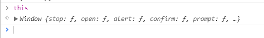

this指向window这个对象，那这个window对象其实就是与其执行环境关联的对象,那作用域就是变量在其中有作用的范围（自己里的理解，若有定义错误，还请指正）。

## 函数生命周期

其实看了上面的那一些概念并不能对作用域和执行环境有很深的理解，下面我将用画图的形式将整个函数生命的周期展现出来。

先写一下示例代码

```js
var a = 10;
function func(a){
  var a = 20;
  a++;
  console.log(a);
}
func();
console.log(a);
```

### 开始执行程序前

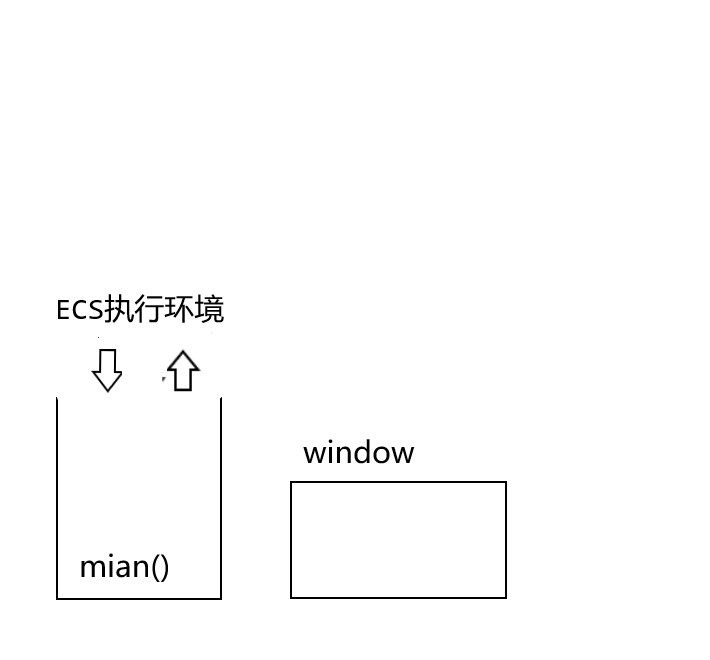

1. 先创建ECS，ECS其实就是专门保存正在调用的函数的执行环境的数组，也可以说对象，其实关联数组也就相当于对象。

2. 然后在ECS中添加浏览器主程序的执行环境main

3. 创建全局作用域对象window

4. main执行环境引用window

### 定义函数时

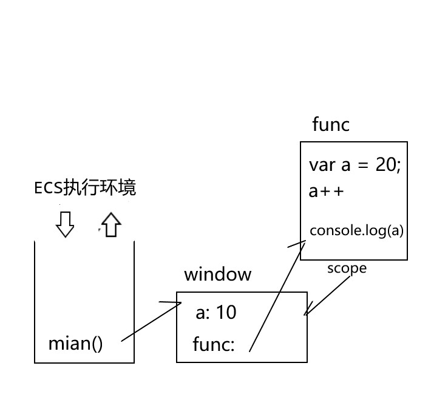

1. 原始类型的全局变量会直接存入window环境当中，函数是引用类型。首先用函数名声明全局变量

2. 然后创建函数对象，封装函数定义

3. 函数对象的scope属性，指回函数创建时的作用域，意思是，函数执行时如果函数本身提供的变量不能让函数执行完全，那它便会去回它创建时的那个作用域去寻找变量。

4. 函数名后面存入指向函数对象的地址

引用类型在其中只能存储地址，这个在我的一篇博文[谈谈值传递](http://hutchins.cn/2017/07/25/%E8%B0%88%E8%B0%88%E5%80%BC%E4%BC%A0%E9%80%92/)中有谈到 

### 函数调用时

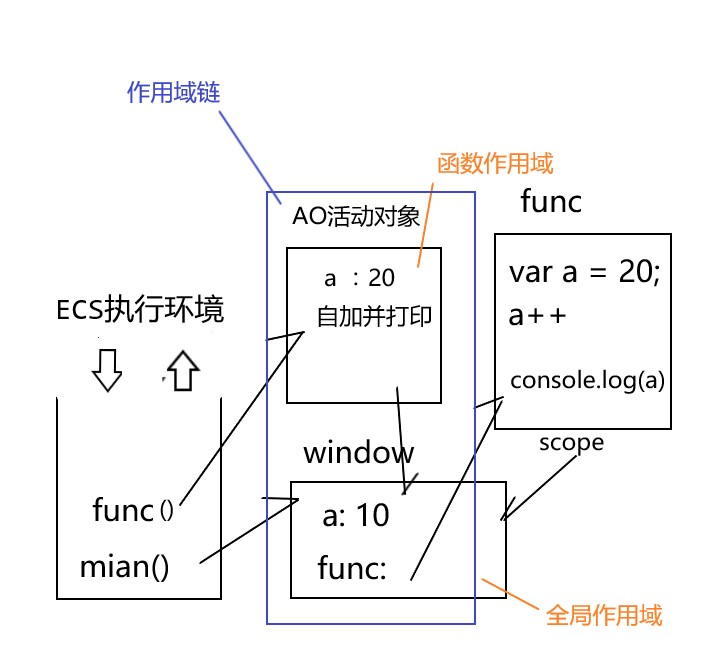

1. 向ECS中压入本次函数调用的执行环境元素

2. 创建本次函数调用时使用的函数作用域对象（AO），也就是临时作用域

3. 在AO中创建储存所有的局部变量，包括形参变量和函数内用var声明的变量

4. 设置AO的parent属性和引用函数的scope属性指向父级作用域对象

5. 函数的执行环境引用AO

6. 顺着那个箭头，现在AO中找变量，也就是局部变量，如果AO中没有，再顺着箭头去父级作用域中找

### 函数调用后

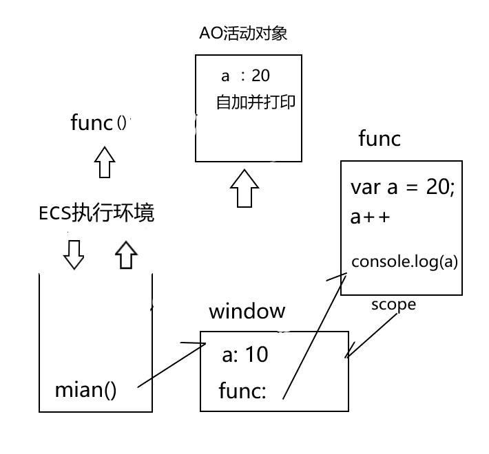

函数的执行环境出栈，AO释放，AO中的局部变量一同被释放掉。

我们得知整个结果之后，自然而然那两个``console``的结果也显然意见。

## 闭包

前面我们提到过，全局变量是可重用但是污染全局，局部变量不会污染全局但是不可重用。

那闭包就是重用变量又保护变量不被污染的机制。

### 特点

#### 包裹受保护的变量和操作变量的内层函数的外层函数 

#### 外层函数要返回内层函数的对象

- return function(){..}
- 直接给全局变量赋值一个内部function
- 将内部函数保存在一个对象的属性或数组元素中 return [function function function]或return {fun:function(){...}}

#### 调用外层函数，用外部变量接住返回的内层函数对象,形成闭包。

### 原理

先贴出示例代码
```js
function outer(){
  var num = 1;
  return function(){
    console.log(num++);
  }
}

var getNum = outer();
getNum();
getNum();
num = 1;
getNum();
```

下面我把闭包形成的原理用画图工具画出来

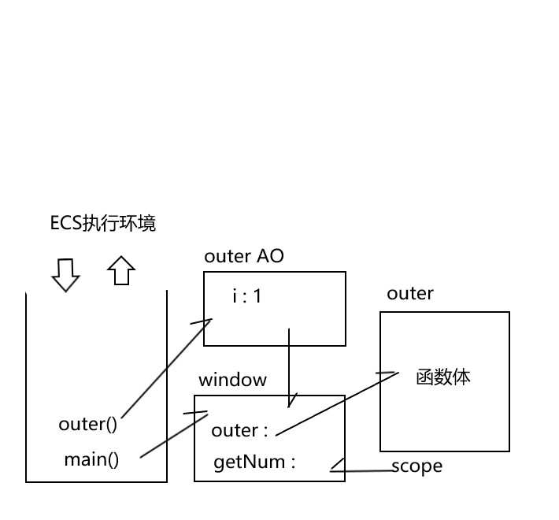

window中存入outer名并指向outer函数对象，getNum因为声明提前也先将变量名存在window中。

``getNum = outer()``其实包含outer的创建和getNum的赋值。

上面的图画的是outer函数进行到``var num = 1;``,前面都有说过，不过多重复。

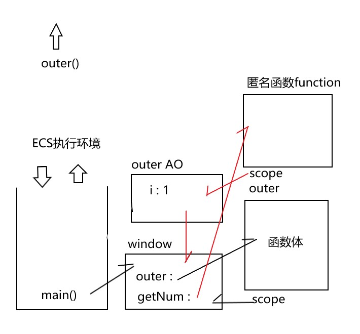


创建了匿名函数，getNum指向了匿名函数对象，匿名对象的scope指向它的父级作用域，也就是outer的作用域，那这样就形成了图中的三角关系，此时outer执行完毕，离开ECS执行环境，outer的AO本也应该随着离开，**但是因为这强大的三角关系，强行拉住不让其释放**，也就形成了所谓的闭包。

**那其实闭包的原因就是**:外层函数的作用域对象无法释放

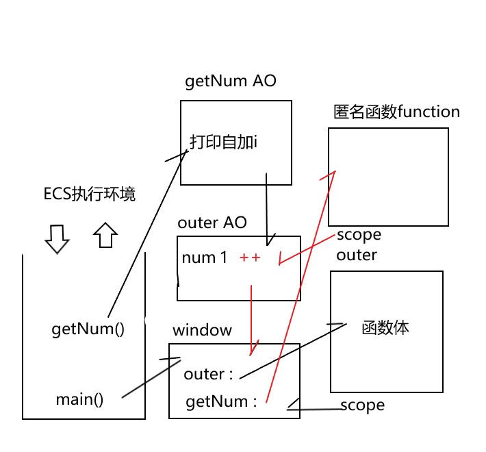

``getNum=outer()``getNum其实就是一个函数

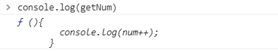

调用``getNum()``,会生成getNum的临时作用域,图中可看出,getNum其实就是在outer中的匿名函数，所以他的parent就指向outer留下的作用域。当他执行``console.log(num++)``的时候，在他的作用域中没有``num``变量他就会顺着作用域链去寻找，最终在outer中的作用域中找到``num``并对其进行自加操作。**所以当下次调用getNum的时候num会从2开始，不会是一开始的1**。

num不是全局变量，还实现了num变量的重复调用。就达到了闭包的目的。

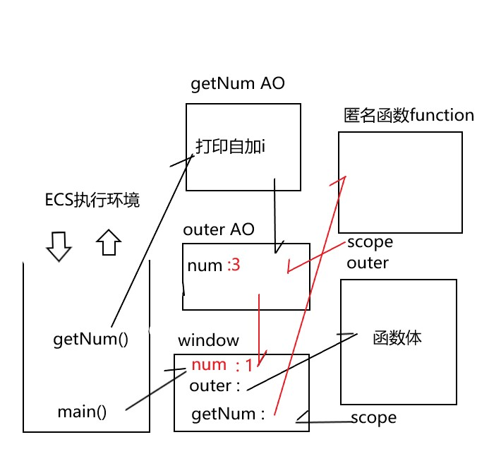

设置``num = 1``只是在window对象上添加存储num的值，当下次调用getNum的时候js引擎还会从getNum作用域开始顺着作用域链寻找``num``,在outerAO就会寻找到``num``,所以根本不会影响到window中的num,也不会受其影响。因此此段代码输出的结果为1 2 3。

### 缺点

当然闭包也有其缺点

- 比普通函数占用更多内存，因为外层函数的作用域对象（AO）始终存在

- 容易造成内存泄漏

### 解决办法

将引用内存函数对象的外部变量重置为null

```js
getNum = null
```

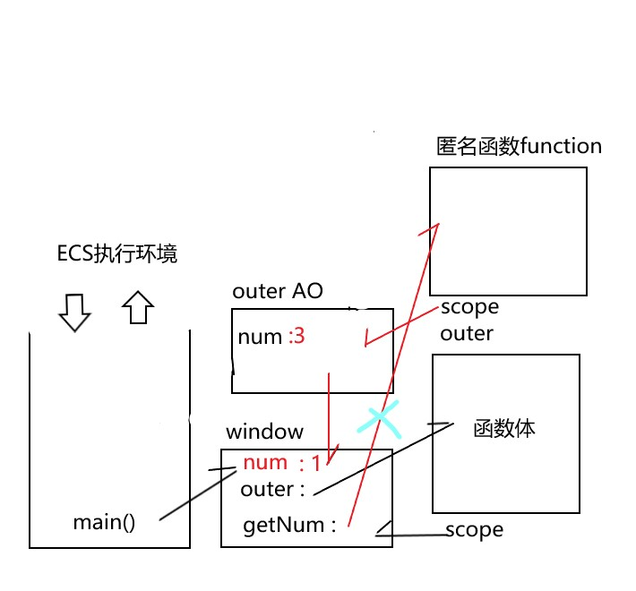

getNum指向outer函数对象的那根线就会断掉，三角关系破裂，那函数对象和outerAO也会相继被销毁。


## 总结 

先讲这么多了，希望帮到需要帮助的人，本文讲的算是比较详细，细细品味应该还是能获得很多东西的。另外补充一句，懂原理真的很重要!懂原理真的很重要!懂原理真的很重要!


