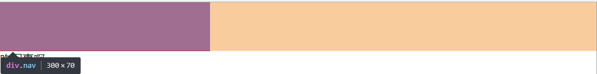
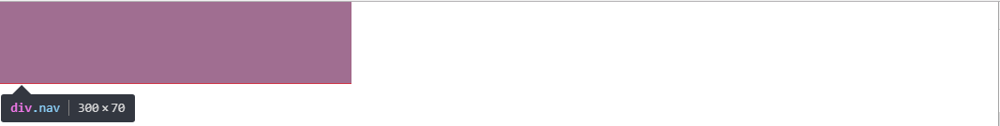

# 用css实现divs水平居中的几种方法

## 初始代码

### HTML

```html
<div class="header">
  <div class="nav"></div>
</div>
```

### CSS
```css
* {
  margin: 0;
  padding: 0;
}
.header {
    height: 70px;
}
.nav {
    height: 70px;
    background: red;    
}
```

<!--more-->

## 当需要居中的div设置了固定宽度

### 方法一
```css
.nav {
    height: 70px;
    background: red;
    width: 300px;
    margin: 0 atuo;
}
```
auto可以理解为一样的意思，如果左右都设置auto，意思就是这个div离左面的距离和右面的距离是一样的,但是此方法只适用于设置了宽度的块级元素，当设置了``position:absolute``或者``float``或者``display:inline``时,``margin:0 auto``便会失效。

#### 原因

块级元素始终独占一行，无论是否设置了宽度，未设置宽度时他会自动充满，设置了宽度时，虽然他看起来这一行并不都是他的地盘，但是你如果在他后面添加元素的时候，你会发现元素会被挤到下一行去。
```html
<div class="header">
  <div class="nav"></div>
  咋回事啊
</div>
```


怎么肥四，为森么会发生这种情况呢



可以看到，虽然div设置了宽度，但是他有一种无形的力量占据了整个他所在的行，以至于其它元素无法与其在一行。而这一块也就是``margin:0 auto``可调控范围，``margin: 0 auto``会根据这一部分的大小分配及时分配左右的距离，达到居中的效果，当设置了绝对定位、浮动或将其设置为行内元素的时候，他这种威慑力便会消失，此时就不会留下范围让``margin: 0 auto``分配。



可以看到，此时那块黄色的区域已经消失，``margin: 0 atuo``也就失效了

不过也有一种例外
```css
.nav {
    height: 70px;
    background: red;
    width: 300px;  
    position: absolute;
    left:0;
    right: 0;
    margin: 0 atuo;
}
```
此时虽然已经设置绝对定位，他已经脱离了标准文档流，但是``left:0 right:0``又让其左右充满父容器，具有了``margin:0 auto``可调控的距离


### 方法二
```css
.nav {
    height: 70px;
    background: red;
    width: 300px;  
    position: absolute;
    left: 50%;
    margin-left: -150px;
}
```
设置绝对定位让其拥有left属性，然后设定``left:50%``，此div便会``left``值就为距离最近的可参考的祖上元素的宽度的一办，那什么是可参考元素呢，就是说设定了``position``属性的，如果祖上元素都没有的话，就参考body、html。

此时div就会跑到中央去，但是因为此div本身还有宽度，因此还要添加``margin-left:-此div宽度的一半px;``让其真正的居中

## 需要居中的元素没有宽度

很多状况下我们要居中的元素是不知道宽度的，有时候可能宽度也不是固定的，因为里面的内容有可能以后要增加，或者随着浏览器的变化此宽度可能也要跟随变化，此效果用js、jq可以实现，但我们本次只谈css

```css
.nav {
    height: 70px;
    background: red;
}
```


可以看到，当不设置宽度的时候，此div默认是充满整个浏览器的，这样的话就无所谓居中或不居中了，通常我们要居中这个div，是想让这个div中的一些信息居中，为了便于演示，我在html和css中都添加了几行代码

```html
<div class="header">
  <div class="nav">
      <ul>
        <li>热爱前端</li>
        <li>热爱编程</li>
        <li>热爱生活</li>
        <li>渴望知识</li>
      </ul>
  </div>
</div>
```
```css
* {
    margin: 0;
    padding: 0;
}
.header {
    height: 70px;
}
.nav {
    height: 70px;
    background: red;
    line-height: 70px;
    color: #fff;
}
ul{
    list-style: none;
}
li{
    float: left;
    margin-left: 30px;
}
```
### 效果图


此时我们应该想办法让div的宽度不是充满整个浏览器，让它的宽度仅仅就是里面内容的宽度，这样我们才能让它居中。在块状元素下，如果不设置宽度，它始终是要充满整个宽度的。


```css
.nav {
    height: 70px;
    background: red;
    line-height: 70px;
    color: #fff;
    display: inline-block;
}
```

当设置``nav``为行内元素，或者table元素的时候他的宽度就默认不是最大化，而是根据包裹的内容改变，也就是最小化。设置为``position``或者``display:table``也一样。

### 方法一
用``text-align:center``实现元素居中，这个属性不是只能让文本居中，它可以让行内元素居中，所以只要把要居中的元素设置为行内元素，然后把其父元素设置``text-align:center``，它就会在其父元素中居中
```css
.header {
	height: 70px;
	text-align: center;
}
.nav {
	height: 70px;
	background: red;
	line-height: 70px;
	color: #fff;
	display: inline-block;
}

```
### 方法二

设置nav为``display:table``,nav就相当与说就具有了``table``的属性，那我们都知道``table``的宽度是根据其内容的多少而变化的，也就是宽度最小化，而此时nav便也可以使用``margin:0 auto``来居中

```css
.nav {
	height: 70px;
	background: red;
	line-height: 70px;
	color: #fff;
	display: table;
	margin: 0 auto;
}
```


