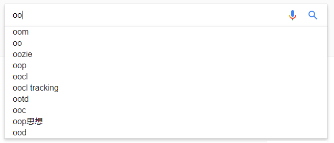
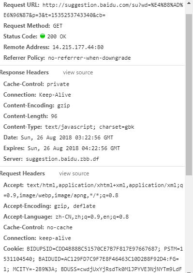

> 最近自己想做的项目需要一个搜索框，并想实现如下搜索提示的功能



本来觉得查查 network 随便抓取一下就可以获得到数据，但事情却不是这么简单

<!--more-->

### 过程

在百度在随便输入字符，查看 network，找到此时请求的链接



会发现使用 get 方式传了四个值,其中 `p` 和 `cb` 都是可以固定的，剩下的就是关键字 `wd` 和此时的时间戳 `t`，自己因为本身是 vue 的项目，就用 `axios` 对此进行请求，结果报错为 **跨域** 并且 **中文乱码**

#### gzip

因为发生了跨域，因此就想用 `node` 去修改请求头去请求，「后来发现用 `node` 去请求不需要修改请求头也不会跨域」，但是还有一个问题返回的中文都是乱码。然后我就去关注了一下响应头，如上面的图片，其中 `content-encoding: gzip` 引起了我的注意。

gzip 是什么在此我就不做过多的解释，去网上查只是说想要**获取 gzip 格式的网页信息需要解压，要不然获得到的信息会是乱码**，其中用到了 `zlib` 和 `request` 两个包

```js
  zlib = require('zlib');

function response (err, res, body) {
//check res header it is gzip
 console.log(res.headers['content-encoding'])
//now body it is gzip stream buffer
      zlib.unzip(body, function(err, buffer) {
             console.log(buffer.toString())
       }

}
    request.get({
        url : apiUrl,
        headers: {
            'Accept-Encoding' : 'gzip',
          },
        encoding : null  // it is very import!!
    }, response)
```

但是我满怀期待的将其解压提取信息后获得的结果依然是乱码，make my heart cold cold

**gbk**

最后又把目光转向响应头，感觉 `charset=gbk` 好像有点东西, 其中用到了 `iconv-lite` ，是一个转编码的工具，`iconv.decode` 接受到第一个参数必须是 `buffer`, 而 `request` 获取到的信息返回的也是 `buffer` 我就感觉冥冥之中放佛预示着什么

```js
request({
        url,
        encoding : null
    }, function(err, response, body) {
        res.setHeader('Content-Type', 'application/json; charset=utf-8')
        res.end(iconv.decode(body, 'gbk'))
    })
```

因此将响应头设置为 utf-8 并将其 gbk 编码转换为 utf-8 后成功的获得到了需要的信息, 下面就是将此 api 部署到我自己的服务器上，关于部署碰到的一些问题基本都在我另一篇文章中有谈到 [记一次oneinstack配置服务器](https://github.com/MLuminary/Blog/issues/15)

[阅读原文](https://github.com/MLuminary/Blog/issues/16)

