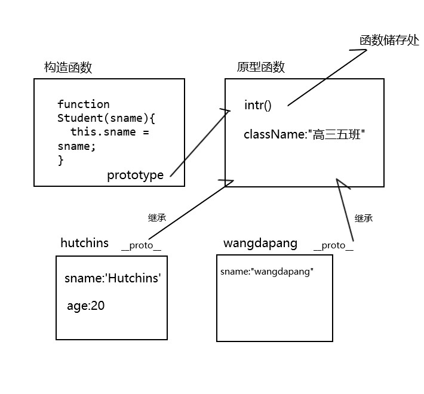
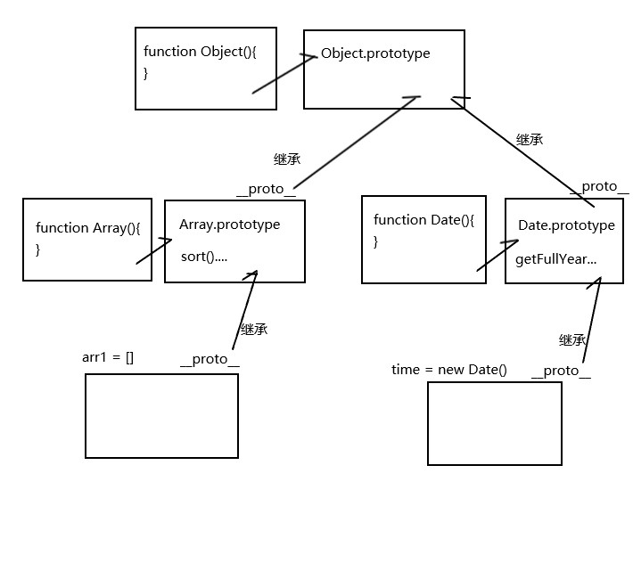
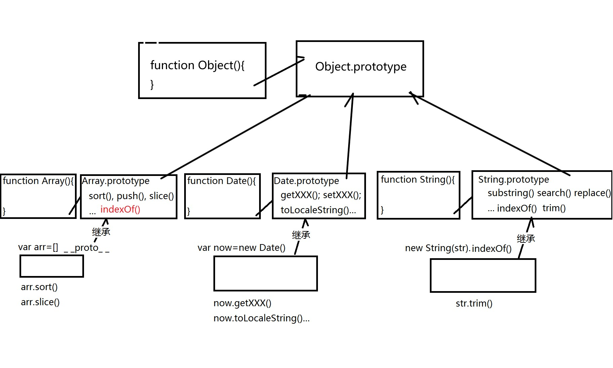

>面向对象程序设计（英语：Object-oriented programming，缩写：OOP）是种具有对象概念的程序编程范型，同时也是一种程序开发的抽象方针。它可能包含数据、属性、代码与方法。对象则指的是类的实例。它将对象作为程序的基本单元，将程序和数据封装其中，以提高软件的重用性、灵活性和扩展性，对象里的程序可以访问及经常修改对象相关连的数据。在面向对象程序编程里，计算机程序会被设计成彼此相关的对象。 --**维基百科**

# 面向对象简介

>面向对象编程是用抽象方式创建基于现实世界模型的一种编程模式。它使用先前建立的范例，包括模块化，多态和封装几种技术。

>相对于 “一个程序只是一些函数的集合，或简单的计算机指令列表。”的传统软件设计观念而言，面向对象编程可以看作是使用一系列对象相互协作的软件设计。 在 OOP 中，每个对象能够接收消息，处理数据和发送消息给其他对象。每个对象都可以被看作是一个拥有清晰角色或责任的独立小机器。

>面向对象程序设计的目的是在编程中促进更好的灵活性和可维护性，在大型软件工程中广为流行。凭借其对模块化的重视，面向对象的代码开发更简单，更容易理解，相比非模块化编程方法 1, 它能更直接地分析, 编码和理解复杂的情况和过程。 -- MDN

# JS面向对象编程

面向对象三大特点：封装、继承、多态。
<!--more-->
## 对象

对象就是需求场景中的名词在程序中的表示，JavaScript中，除了string、number、boolean、null、undefined之外，其它的数据都是对象，如数组、日期深知函数等.

## 对象概述

对象是一种特殊的数据类型，可以包含多个成员，对象的成员分为两种：属性和方法。

### 属性

封装对象的数据，表示与对象有关的值

对象名.属性名

### 方法

封装对象的行为，表示对象可以执行的行为或可以完成的功能

对象名.方法名()

## js对象分类

### 内置对象/原生对象

String、Boolean、Number、Object、Function、Array、Date、RegExp、Math、Error、Global

### 宿主对象

BOM(Browser Object Model)对象和DOM(Document Object Model)对象

### 自定义对象

用户创建的对象

## 创建对象--封装

将一个事物的属性和功能集中定义在一个对象中，事物的属性会成为对象的属性，事物的功能会成为对象的方法。其实就是保存在对象中的普通变量和普通函数。属性和方法统称为对象的成员。

### 用对象直接量

```js
var obj1 = {
  属性名:值,
  ...:...,
  方法名:function(){
    ... this.属性名 ...
  }
}

//ES6
var obj1 = {
  属性名:值,
  ...:...,
  方法名(){
    ... this.属性名 ...
  }
}
```

在方法中要获得此对象的属性值，必须要用this.,原因就是**js没有块级作用域**,而作用域链便是变量的范围,因为js中没有块级作用域，所以在作用域链中根本是找不到对象的属性名的。

对象中的函数调用会创建临时的活动对象，而此对象会指向window,也就是说，如果在此函数作用域中找不到变量名会去window中找，如果再找不到就会报错，此变量名not defined.

而用this.的话便会直接去此对象中找。

### 用new创建

```js
//先创建一个空对象
var obj = new Object();
//为对象添加属性和方法
obj.属性名 = 属性值
obj.方法名 = function(){
  ... this.属性名...
}
//访问对象属性，属性名是变化的变量
obj[变量] = 属性值
```

以上两种方法第一个是用于已知道对象结构的时候，第二个是用于还不知道对象的结构，但是这两种方法都不适用于多次创建相同结构的对象。因为要创建相同结构的对象时要写大量重复的代码

### 用构造函数

用来规定一类对象统一结构的函数。

```js
//定义构造函数
function 类型名(属性参数){
  this.属性名 = 属性参数;
  this.方法名 = function(){
    ... this.属性名...
  }
  //不过js基本不会把方法定义在构造函数中
}
```

举个栗子

```js
function Student(sname){
  this.sname = sname;
  this.intr = function(){
    console.log("I'm "+this.sname)
  }
}

//用new调用构造函数
var hutchins = new Student("Hutchins");
hutchins.intr();//"I'm Hutchins"

//创建不同名只需如下
var wangdapang = new Student("wangdapang")
```

在构造函数中定义方法，每new一次，都会创建函数对象副本，无法节约内存。

## 原型对象--继承

集中保存同一类型的所有子对象共有成员的父对象

原型对象不用创建，在定义构造函数同时，已经自动创建了该类型的原型对象，构造函数``.prototype``指向原型对象,原型对象``.constructor``指回构造函数.

### 自有属性

直接保存在对象本地的属性

#### 读取

子对象.属性

#### 修改

子对象.属性名 = 值

#### 判断

```js
var bool = obj.hasOwnProperty("属性名")
```

### 共有属性

保存在原型对象中，所有子对象共有的属性

#### 读取

子对象.属性

#### 修改

构造函数.prototype.属性名 = 值

#### 判断

```js
(obj.属性名!==undefined)&&(属性名 in obj)
```

举个栗子

```js
function Student(sname){
  this.sname = sname;
}
//向原型函数中添加intr方法
Student.prototype.intr = function(){
  console.log("I'm "+this.sname)
}
//想给两人共同添加一个班级
Student.prototype.className = "高三五班";//共有属性，子对象都可以访问

var hutchins = new Student("Hutchins");
var wangdapang = new Student("wangdapang");
//hutchins的私有属性
hutchins.age = 20;
console.log(hutchins.className);//高三五班
```

下面用图画的形式画一下这整个结构



### new的四件事

1. 创建一个新的空对象
2. 自动让新的子对象继承构造函数的原型对象，自动设置子对象的``__proto__``指向构造函数的原型对象
3. 调用构造函数，将构造函数中的``this``执行正在创建的新对象。向新的空对象中强行添加新成员
4. 将新对象地址返回给变量保存

### 内置对象的原型对象

其实内置对象类型都是构造函数，每种类型都有自己的原型对象.其原型对象中保存中所有该类型的子对象共用的API。

例如数组和日期

下面用简化的图展示一下



这也说明为什么类数组不能调用``sort``,因为只有Array的原型函数上有``sort``方法。
同时这张图也展现出为何``typeof``Array和Date都是``function``

### 原型链

prototype chain,由多级父对象逐级继承形成的链式结构

原型链中保存了所有对象的属性，控制着对象成员的使用顺序：先用自己有的属性和方法，如果自己没有，才沿着原型链向父级去找，如果整个原型链中都没有，返回undefined。



## 多态

同一个方法，在不同情况下表现出不同的状态，而且如果子对象觉得父对象的成员不好用，可在本地定义同名自有成员，来覆盖父对象中的成员

## 总结

本篇主要是面向对象的一些基础，包括封装继承多态，过不久还会写一篇。主要是用一些实际的例子来加深对面向对象的理解，还有自定义继承等。