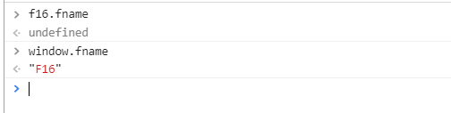
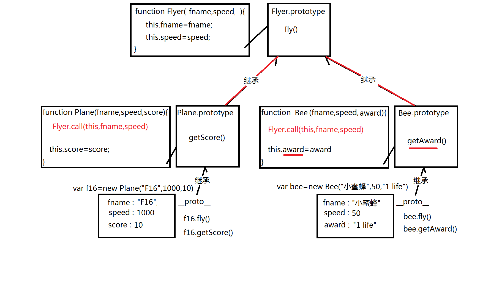

## 引言

上一篇我们了解到了面向对象的一些基础知识，这篇就来说一下用面向对象知识解决一些问题，加深对面向对象的理解。

## 判断一个对象是不是数组类型

### typeof

少部分人可能首先会想到``typeof``

```js
var n=3,b=true,s="Hello",x=null,y,
		obj1=function(){},
		obj2={},obj3=[],obj4=new Date();
		console.log(
			typeof n,//number
			typeof b,//boolean
			typeof s,//string
			typeof x,//object
			typeof y,//undefined
			typeof obj1,//function
			typeof obj2,//object
			typeof obj3,//object
			typeof obj4,//object
		);
```

可以看出``typeof``是可以判断出基本数据类型的，函数也能判断出来，但是对象、数组、日期都会返回object,这样就根本无法判断一个对象是不是数组类型。所以``typeof``第一个就应该被pass掉
<!--more-->
### 判断其父级原型对象

```js
var obj1={},
    obj2=[1,2,3],
    obj3=new Date();

console.log(obj1.__proto__ == Array.prototype);//false
console.log(obj2.__proto__ == Array.prototype);//true
console.log(obj3.__proto__ == Array.prototype);//false
```

但是``__proto__``是内部属性，本不应该被访问到，我们可以用``Object.getPrototypeOf(obj)``方法来代替他，虽然这个方法其实内部原理也是他，但是还是有不同的。

```js
console.log(Object.getPrototypeOf(obj1)==Array.prototype);//false
console.log(Object.getPrototypeOf(obj2)==Array.prototype);//true
console.log(Object.getPrototypeOf(obj3)==Array.prototype);//false
```

### 判断其构造函数

``obj instanceof Array``判断obj是不是被构造函数Array创造出来的,但``instanceof``不仅判断直接父类型，而是所有在原型链上的类型，都返回true,所以如果你创建一个对象但是把他的``__proto__``指向Array的原型，然后判断其类型，也会返回true。

```js
console.log(obj1 instanceof Array);
console.log(obj2 instanceof Array);//true
console.log(obj3 instanceof Array);
```

### 判断对象内部的class属性

每个对象内部，都有一个隐藏的class属性，记录该对象创建时的数据类型class属性不会随继承关系的改变而改变。（就相当于查人的DNA了吧，小样还想伪装。）

这里有一个问题：只有最顶层的``toString()``才能输出对象的class属性值,但是内置类型的原型对象中几乎都重写了新的``toString()``。

我们可以用``call``来强行调用,``call``可以让一个对象调用一个本来无法调用到的函数,在这里不细说。

``要调用的函数.call(对象)``

```js
console.log(
	Object.prototype.toString.call(obj1)
	/*[object Object]*/=="[object Array]"
);//false
console.log(
	Object.prototype.toString.call(obj2)
	/*[object Array]*/=="[object Array]"
);//true
console.log(
	Object.prototype.toString.call(obj3)
	/*[object Date]*/=="[object Array]"
);//false
```

## 自定义继承

### 仅修改两个对象间的继承关系

```js
//获得子对象的父对象
var father = Object.getPrototypeOf(child);
//设置子对象继承指定父对象
Object.setPrototypeOf(child,father)
```

### 修改构造函数原型对象

```js
//father为另一个原型对象
构造函数.prototype = father;
```

必须紧跟在构造函数定义之后，开始创建子对象之前修改，如果创建了子对象才去修改，那先前的那些子对象还是指向以前的原型对象。

### 两种类型间的继承

如果发现多个类型拥有部分相同的属性结构和方法定义，可以抽象一个共同的父类型

比如雷电中的战机和蜜蜂，战机和蜜蜂都有名字和速度，都会飞行。不同的是战机被击毁会得分数，蜜蜂被击毁会得到一些道具。

```js
//战机
function Plane(fname,speed,score){
	this.fname = sname;
	this.speed = speed;
	this.scpre = score;
}
Plane.prototype.fly(){....}
Plane.prototype.getScore(){....}
//蜜蜂
function Bee(fname,speed,award){
	this.fname = sname;
	this.speed = speed;
	this.award = award;
}
Bee.prototype.fly(){...}
Bee.prototype.getAward(){...}
```

可以看到，有很多的重复代码，此时我们可以抽象一个父类，把一些共用的方法和属性放到父类上，减少不必要的代码。

```js
//创建飞行器的构造函数
function Flyer(fname,speed){
	this.fname = fname;
	this.speed = speed;
}
//定义通用的飞行的方法
Flyer.prototype.fly(){....}
//战机
function Plane(fname,speed,score){
	Flyer.call(this,fname,speed);//D(等下解释)
	this.scpre = score;
}
Plane.prototype.getScore(){....}
//蜜蜂
function Bee(fname,speed,award){
	Flyer.call(this,fname,speed);
	this.award = award;
}
Bee.prototype.getAward(){...}
//各自创建一个对象
var bee = new Bee("小蜜蜂",50,"1 life");
var f16 = new Plane("F16",1000,10);
//将原型指向共同的父原型对象
Object.setPrototypeOf(Plane.prototype,Flyer.prototype)
Object.setPrototypeOf(Bee.prototype,Flyer.prototype)
```

D标记处不能用直接用``Flyer(fname,speed)``,假如我就是这样写。在控制台打印``f16.fname``是获取不到你定义时的值的。



而调用``window.fname``的时候却出现了我们想定义在f16上的值。为什么呢，首先``Plane``方法中的``this``是没毛病的。原因在于我们只传入``Flyer``中两个值，而``Flyer``中添加这两个值的时候用的是自己的``this``,而``Flyer``中的``this``是默认指向全局对象的，所以最终添加在``window``上。用``call``将其``this``暂时性替换成指向用new创建出的对象的``this``,来达到调用父类方法，添加到子对象上属性值的效果。

最终整个代码形成的原型链用图画出来就像下面这样




## 最后

面向对象还涉及到很多东西，ES5，ES6也新加了一些东西，后面也准备将知识梳理梳理整理出来，今天实在困。就先溜了